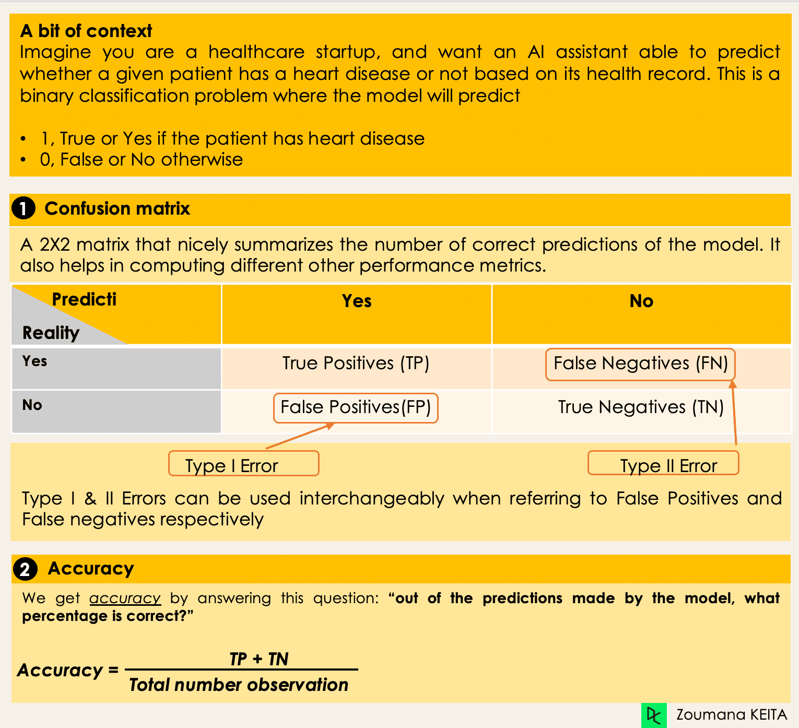
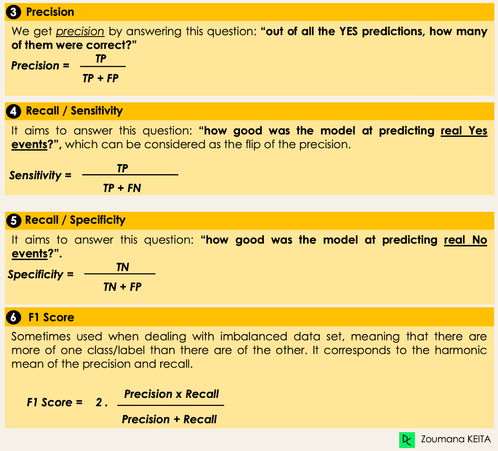
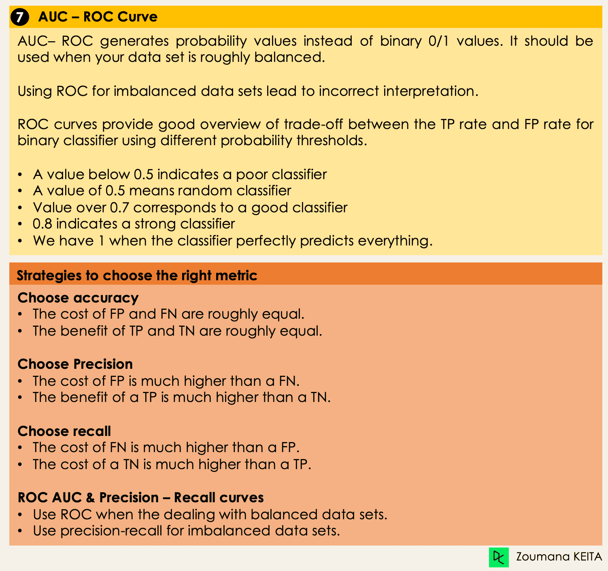

## ¿Qué es la clasificación en el machine learning?

La clasificación es un método de machine learning supervisado en el que el modelo intenta predecir la etiqueta correcta de unos datos de entrada dados. En la clasificación, el modelo se entrena completamente con los datos de entrenamiento, y luego se evalúa con los datos de prueba antes de utilizarlo para realizar predicciones sobre nuevos datos no vistos.

Por ejemplo, un algoritmo puede aprender a predecir si un determinado correo electrónico es spam o ham (no spam).

Antes de sumergirnos en el concepto de clasificación, primero comprenderemos la diferencia entre los dos tipos de alumnos en la clasificación: los alumnos perezosos y los ansiosos. A continuación aclararemos el concepto erróneo entre clasificación y regresión. 

## Aprendices perezosos Vs. Aprendices ansiosos

En la clasificación del machine learning hay dos tipos de aprendices: los perezosos y los ansiosos. 

**Los aprendices ávidos** son algoritmos de machine learning que primero construyen un modelo a partir del conjunto de datos de entrenamiento antes de hacer cualquier predicción sobre futuros conjuntos de datos. Dedican más tiempo durante el proceso de entrenamiento por su afán de tener una mejor generalización durante el entrenamiento a partir del aprendizaje de los pesos, pero requieren menos tiempo para hacer predicciones. 

La mayoría de los algoritmos de machine learning aprenden con avidez, y a continuación te damos algunos ejemplos: 

- Regresión logística. 
- Máquina de vectores soporte. 
- Árboles de decisión. 
- Redes neuronales artificiales. 

En cambio, **los aprendices perezosos** o basados en instancias no crean ningún modelo inmediatamente a partir de los datos de entrenamiento, y de ahí viene el aspecto perezoso. Se limitan a memorizar los datos de entrenamiento, y cada vez que hay que hacer una predicción, buscan al vecino más próximo a partir de todos los datos de entrenamiento, lo que les hace muy lentos durante la predicción. Algunos ejemplos de este tipo son: 

- Vecino más próximo K. 
- Razonamiento basado en casos. 

Sin embargo, algunos algoritmos, como BallTrees y KDTrees, pueden utilizarse para mejorar la latencia de la predicción. 

## Machine learning Clasificación Vs. Regresión

Hay cuatro categorías principales de algoritmos de machine learning: supervisados, no supervisados, semisupervisados y de aprendizaje por refuerzo. 

Aunque la clasificación y la regresión pertenecen ambas a la categoría del aprendizaje supervisado, no son lo mismo.

- La tarea de predicción es una **clasificación** cuando la variable objetivo es `discreta`. Una aplicación es la identificación del sentimiento subyacente de un texto. 

- La tarea de predicción es una **regresión** cuando la variable objetivo es `continua`. Un ejemplo puede ser la predicción del salario de una persona dado su grado de estudios, su experiencia laboral previa, su ubicación geográfica y su nivel de antigüedad.

## Ejemplos de clasificación de machine learning en la vida real 

El machine learning supervisado La clasificación tiene distintas aplicaciones en múltiples ámbitos de nuestra vida cotidiana. Aquí tienes algunos ejemplos. 

### Sanidad 
Entrenar un modelo de machine learning con datos históricos de pacientes puede ayudar a los especialistas sanitarios a analizar con precisión sus diagnósticos: Durante la pandemia de COVID-19, se aplicaron modelos de machine learning para predecir eficazmente si una persona tenía COVID-19 o no. 

### Transporte
El transporte es el componente clave del desarrollo económico de muchos países. Como resultado, las industrias están utilizando modelos de machine learning y deep learning: Predecir qué lugar geográfico tendrá un aumento del volumen de tráfico. 

### Agricultura sostenible
La agricultura es uno de los pilares más valiosos de la supervivencia humana. Introducir la sostenibilidad puede ayudar a mejorar la productividad de los agricultores a otro nivel sin dañar el medio ambiente:
Utilizando modelos de clasificación para predecir qué tipo de terreno es adecuado para un determinado tipo de semilla o Predecir el tiempo para ayudarles a tomar las medidas preventivas adecuadas. 


## Diferentes tipos de tareas de clasificación en machine learning 

Hay cuatro tareas principales de clasificación en el machine learning: clasificaciones binarias, multiclase, multietiqueta y desequilibradas. 

### Clasificación binaria
En una tarea de clasificación binaria, el objetivo es clasificar los datos de entrada en dos categorías mutuamente excluyentes. En tal situación, los datos de entrenamiento se etiquetan en formato binario: verdadero y falso; positivo y negativo; O y 1; spam y no spam, etc., según el problema que se aborde. Por ejemplo, podríamos querer detectar si una imagen dada es un camión o un barco. 

Los algoritmos de `Regresión Logística` y `Máquinas de Vectores Soporte` están diseñados nativamente para clasificaciones binarias. Sin embargo, para la clasificación binaria también pueden utilizarse otros algoritmos, como el de `Vecinos más Próximos (K-Nearest Neighbors)` y el de `Árboles de Decisión (Decision Trees)`. 

### Clasificación Multiclase

La clasificación multiclase, por otra parte, tiene al menos dos etiquetas de clase mutuamente excluyentes, donde el objetivo es predecir a qué clase pertenece un ejemplo de entrada dado. Por ejemplo, un modelo de machine learning que prediga si en una imagen hay un camión, un barco o un avión.

La mayoría de los algoritmos de clasificación binaria también pueden utilizarse para la clasificación multiclase. Estos algoritmos incluyen, entre otros: 

- Bosque aleatorio
- Bayes ingenuos 
- Vecinos más próximos K 
- efuerzo de gradiente 
- SVM
- Regresión logística.

*Nota: podemos aplicar enfoques de transformación binaria, como uno contra uno y uno contra todos, para adaptar los algoritmos nativos de clasificación binaria a las tareas de clasificación multiclase.*

### Clasificación multietiqueta
En las tareas de clasificación multietiqueta, intentamos predecir 0 o más clases para cada ejemplo de entrada. En este caso, no hay exclusión mutua porque el ejemplo de entrada puede tener más de una etiqueta. 

Este escenario puede observarse en distintos ámbitos, como el autoetiquetado en el Procesamiento del Lenguaje Natural, donde un texto dado puede contener múltiples temas. De forma similar a la visión por ordenador, una imagen puede contener múltiples objetos.

No es posible utilizar modelos de clasificación multiclase o binarios para realizar una clasificación multietiqueta. Sin embargo, la mayoría de los algoritmos utilizados para esas tareas de clasificación estándar tienen sus versiones especializadas para la clasificación multietiqueta. Podemos citar: 

- Árboles de decisión multietiqueta
- Potenciación por gradiente multietiqueta
- Bosques aleatorios multietiqueta

### Clasificación desequilibrada
En la clasificación desequilibrada, el número de ejemplos se distribuye de forma desigual en cada clase, lo que significa que podemos tener más de una clase que de las otras en los datos de entrenamiento. Consideremos el siguiente escenario de clasificación de 3 clases en el que los datos de entrenamiento contienen: El 60% de los camiones, el 25% de los aviones y el 15% de los barcos. 

El problema de la clasificación desequilibrada podría darse en el siguiente supuesto: Detección de transacciones fraudulentas en industrias financieras - Diagnóstico de enfermedades raras  - Análisis de la rotación de clientes.

El uso de modelos predictivos convencionales, como los Árboles de Decisión, la Regresión Logística, etc., podría no ser eficaz cuando se trata de un conjunto de datos desequilibrado, porque podrían estar sesgados hacia la predicción de la clase con mayor número de observaciones, y considerar como ruido las que tienen menor número. 

Podemos utilizar múltiples enfoques para abordar el problema del desequilibrio en un conjunto de datos. Los enfoques más utilizados incluyen técnicas de muestreo o el aprovechamiento de la potencia de los algoritmos sensibles a los costes.

#### Técnicas de muestreo 
Estas técnicas pretenden equilibrar la distribución del original mediante: 
- Sobremuestreo basado en conglomerados
- Submuestreo aleatorio: eliminación aleatoria de ejemplos de la clase mayoritaria. 
- Sobremuestreo SMOTE: réplica aleatoria de ejemplos de la clase minoritaria

#### Algoritmos sensibles a los costes 
Estos algoritmos tienen en cuenta el coste de una clasificación errónea. Su objetivo es minimizar el coste total generado por los modelos.

- Árboles de decisión sensibles a los costes.
- Regresión logística sensible a los costes. 
- Máquinas de vectores de apoyo sensibles a los costes.

### Métricas para evaluar los algoritmos de clasificación del machine learning
Ahora que tenemos una idea de los distintos tipos de modelos de clasificación, es crucial elegir las métricas de evaluación adecuadas para esos modelos. En esta sección, trataremos las métricas más utilizadas: exactitud, precisión, recuerdo, puntuación F1 y área bajo la curva ROC (Receiver Operating Characteristic) y AUC (Area Under the Curve). 





### Aplicación de las estrategias de muestreo 
Exploraremos aquí dos estrategias de muestreo: el submuestreo aleatorio y el sobremuestreo SMOTE. Recordemos que la idea de esto es utilizarlo cuando nuestros datos a predecir no son parejos.

#### Submuestreo aleatorio 
Submuestrearemos la clase mayoritaria, que, en este caso, corresponde a la "totalmente pagada" (clase 0). 

```python
    X = encoded_loan_data.drop('not.fully.paid', axis = 1)
    y = encoded_loan_data['not.fully.paid']

    X_train, X_test, y_train, y_test = train_test_split(X, y, test_size=0.30,
                                                        stratify = y, random_state=2022)
    X_train_cp = X_train.copy()
    X_train_cp['not.fully.paid'] = y_train
    y_0 = X_train_cp[X_train_cp['not.fully.paid'] == 0]
    y_1 = X_train_cp[X_train_cp['not.fully.paid'] == 1]
    y_0_undersample = y_0.sample(y_1.shape[0])
    loan_data_undersample = pd.concat([y_0_undersample, y_1], axis = 0)

    # Visualize the proportion of borrowers
    show_loan_distrib(loan_data_undersample)
```
#### Sobremuestreo SMOTE
Realiza un sobremuestreo en la clase minoritaria

```python
    smote = SMOTE(sampling_strategy='minority')
    X_train_SMOTE, y_train_SMOTE = smote.fit_resample(X_train,y_train)
    # Visualize the proportion of borrowers
    show_loan_distrib(y_train_SMOTE)
```

### Aplicación de Regresión logística 
Se trata de un algoritmo explicable. Clasifica un punto de datos modelando su probabilidad de pertenecer a una clase determinada mediante la función sigmoidea. 
```python
    X = loan_data_undersample.drop('not.fully.paid', axis = 1)
    y = loan_data_undersample['not.fully.paid']
    X_train, X_test, y_train, y_test = train_test_split(X, y, test_size=0.15, stratify = y, random_state=2022)
    logistic_classifier = LogisticRegression()
    logistic_classifier.fit(X_train, y_train)
    y_pred = logistic_classifier.predict(X_test)
    print(confusion_matrix(y_test,y_pred))
    print(classification_report(y_test,y_pred))
```


## Referencia

[Datacamp: classification-machine-learning](https://next-marketing.datacamp.com/es/blog/classification-machine-learning)