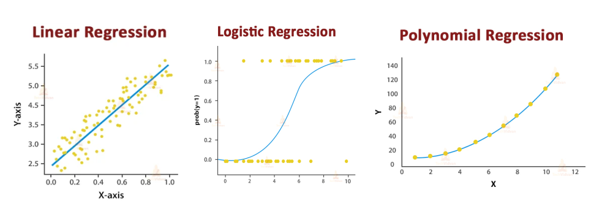

# Resumen del curso

## Data Manipulation - Pandas

Antes que todo dejo un breve repaso para trabajar con la librería Pandas.

Veamos algunos comandos de la librería para trabajar con DataFrames y manipular los datos.

### Read and Write files

Las funciones `read_*` sirven para leer los datos de un archivo y cargarlos en un pandas mientras que las funciones `to:*` sirven para guardar un dataframe en ese tipo de archivo. Ejemplo:

```python
    Autos = pd.read_csv('../Auto.csv') # Importar
    Autos.to_excel("autos.xlsx", sheet_name="Autos", index=False) # Exportar
```

### Specific Columns from a DatFrame

Seleccionar filas y/o columnas específicas utilizando `loc` cuando utilizamos los `nombre` de filas y/o columnas.

Seleccionar filas y/o columnas específicas utilizando `iloc` cuando utilizamos su `posición` en la tabla.

```python
    New_Cars = Autos.loc[Autos["year"] > 80]
    New_Cars.iloc[1:10, 2:9]
```

### Creación de nuevas columnas

A partir de un dataframe dado, podemos crear nuevas columnas a partír de cálculos hechos con las mismas, como por ejemplo si deseamos pasar de litros a galones o de kilómetros a millas. En el siguiente ejemplo vemos como se crea una nueva columna para pasar de MPG a KML:

```python
    df["KML.highway"] = df["MPG.highway"] * 0.43
```

### Función sort() en Pandas:

La función `sort()` en Pandas se utiliza para ordenar los datos en un DataFrame o una Serie. Puedes ordenar los datos basados en los valores de una o varias columnas, en orden ascendente o descendente. Veamos la sintaxis y luego explicamos cada parámetros:

```python
    DataFrame.sort_values(by='Price', axis=0, ascending=True, inplace=False, kind='quicksort', na_position='last')
```
- `by`: Especifica la(s) columna(s) por la(s) cual(es) se ordenarán los datos.
- `axis`: Especifica si se ordena por filas (axis=0) o columnas (axis=1). Por defecto, es 0 (filas).
- `ascending`: Especifica si el orden es ascendente (True) o descendente (False). Por defecto, es True.
- `inplace`: Si se establece como True, la modificación se realizará en el DataFrame original.
- `kind`: Método de ordenación. Puede ser 'quicksort', 'mergesort', 'heapsort' o 'stable'.
- `na_position`: Especifica cómo manejar los valores NA. Puede ser 'last' (los valores NA se colocan al final) o 'first' (los valores NA se colocan al principio).

### Función groupby() en Pandas:

La función `groupby()` en Pandas se utiliza para dividir los datos en grupos basados en algunos criterios. Después de dividir los datos en grupos, se pueden aplicar operaciones agregadas a cada grupo, como suma, promedio, contar, etc.

```python
    # Sintaxis
    DataFrame.groupby(by=None, axis=0, level=None, as_index=True, sort=True, group_keys=True, squeeze=<object object>)
```

- `by`: Especifica las columnas o funciones por las cuales se realizará el agrupamiento.
- `axis`: Especifica si se agrupa por filas (axis=0) o columnas (axis=1). Por defecto, es 0 (filas).
- `level`: Si el eje es un MultiIndex, entonces el nivel o niveles (clave o claves) se utilizan.
- `as_index`: Si es True, los grupos se devolverán con etiquetas como índices. Si es False, los grupos se devolverán como objetos DataFrame.
- `sort`: Especifica si se ordenan los resultados.
- `group_keys`: Si es True, añade las claves de grupo al índice resultante.

Veamos un ejemplo:

```python
    import pandas as pd

    data = {'Name': ['Alice', 'Bob', 'Charlie', 'Alice', 'Bob'],
            'Age': [25, 30, 20, 25, 30],
            'Salary': [50000, 60000, 45000, 52000, 62000]}

    df = pd.DataFrame(data)

    # Agrupar por la columna 'Name' y calcular el promedio del salario
    grouped_df = df.groupby('Name')['Salary'].mean()
    print(grouped_df)
```

### Funciones útiles

Agrego algunas funciones/métodos que son útiles:

#### str.contains()
Este método se utiliza para verificar si cada elemento de la Serie (columna) contiene una cadena específica. 
- `case=True`: Indica que la búsqueda es sensible a mayúsculas y minúsculas.
- `regex=True`: Indica que la cadena proporcionada es una expresión regular. Esto permite realizar coincidencias más flexibles y avanzadas.

Ejemplo:

```python
    pumpkins = pumpkins[pumpkins['Package'].str.contains('bushel', case=True, regex=True)]
```

#### DatetimeIndex()
Este método se utiliza para crear un objeto de índice de fecha y hora a partir de una columna que contiene fechas y/o horas. En el siguiente ejemplo se quiere acceder al mes de una columna en particular:

```python
    month = pd.DatetimeIndex(pumpkins['Date']).month
```

## Regresión

La regresión busca encontrar la relación funcional entre las variables independientes (input) y la variable dependiente (output). Esta relación se representa típicamente como una función matemática. En términos simples, la regresión intenta ajustar una línea (o curva) que mejor se ajuste a los datos observados.

La regresión se utiliza cuando queremos predecir valores `numéricos`. Algunos ejemplos de aplicación incluyen predecir precios de viviendas basados en características como el tamaño, el número de habitaciones, etc.

### Tipos de regresiones:
- *Regresión lineal*: Busca ajustar una línea recta que mejor se ajuste a los datos.
- *Regresión polinómica*: Utiliza una función polinómica para ajustarse a los datos en lugar de una línea recta.
- *Regresión logística*: Se utiliza cuando la variable dependiente es binaria (0/1) y queremos predecir la probabilidad de que ocurra un evento.
- *Regresión Ridge y Lasso*: Métodos de regresión lineal regularizados que ayudan a prevenir el sobreajuste al agregar términos de penalización a la función de pérdida.
- *Regresión de series temporales*: Utilizada cuando los datos tienen una estructura de tiempo y se busca predecir valores futuros.
- *Regresión de vecinos más cercanos (KNN)*: Utiliza los valores de las k observaciones más cercanas para predecir el valor de una nueva observación.



### Cómo se utilizan en scikit-learn:

Aquí hay un ejemplo simple de cómo usar regresión lineal en scikit-learn:

```python
    from sklearn.model_selection import train_test_split
    from sklearn.linear_model import LinearRegression

    # Suponiendo que tenemos X como nuestras características y y como nuestros objetivos
    X_train, X_test, y_train, y_test = train_test_split(X, y, test_size=0.2, random_state=42)

    # Crear un modelo de regresión lineal
    model = LinearRegression()

    # Entrenar el modelo
    model.fit(X_train, y_train)

    # Hacer predicciones
    predictions = model.predict(X_test)
```

## Clasificación

> [Aquí](./Classification/README.md) se explica mejor toda la teoria adquirida sobre clasificación

La clasificación es un método de machine learning supervisado en el que el modelo intenta predecir la etiqueta correcta de unos datos de entrada dados. En la clasificación, el modelo se entrena completamente con los datos de entrenamiento, y luego se evalúa con los datos de prueba antes de utilizarlo para realizar predicciones sobre nuevos datos no vistos.

### Machine learning Clasificación Vs. Regresión

Hay cuatro categorías principales de algoritmos de machine learning: supervisados, no supervisados, semisupervisados y de aprendizaje por refuerzo. 

Aunque la clasificación y la regresión pertenecen ambas a la categoría del aprendizaje supervisado, no son lo mismo.

- La tarea de predicción es una **clasificación** cuando la variable objetivo es `discreta`. Una aplicación es la identificación del sentimiento subyacente de un texto. 

- La tarea de predicción es una **regresión** cuando la variable objetivo es `continua`. Un ejemplo puede ser la predicción del salario de una persona dado su grado de estudios, su experiencia laboral previa, su ubicación geográfica y su nivel de antigüedad.

### Diferentes tipos de tareas de clasificación en machine learning 

Hay cuatro tareas principales de clasificación en el machine learning: clasificaciones binarias, multiclase, multietiqueta y desequilibradas. 

#### Clasificación binaria

En una tarea de clasificación binaria, el objetivo es clasificar los datos de entrada en dos categorías mutuamente excluyentes. En tal situación, los datos de entrenamiento se etiquetan en formato binario: verdadero y falso; positivo y negativo; O y 1; spam y no spam, etc., según el problema que se aborde.

#### Clasificación Multiclase

La clasificación multiclase, por otra parte, tiene al menos dos etiquetas de clase mutuamente excluyentes, donde el objetivo es predecir a qué clase pertenece un ejemplo de entrada dado. Por ejemplo, un modelo de machine learning que prediga si en una imagen hay un camión, un barco o un avión.

#### Clasificación multietiqueta

En las tareas de clasificación multietiqueta, intentamos predecir 0 o más clases para cada ejemplo de entrada. En este caso, no hay exclusión mutua porque el ejemplo de entrada puede tener más de una etiqueta. 

Este escenario puede observarse en distintos ámbitos, como el autoetiquetado en el Procesamiento del Lenguaje Natural, donde un texto dado puede contener múltiples temas. De forma similar a la visión por ordenador, una imagen puede contener múltiples objetos.

#### Clasificación desequilibrada

En la clasificación desequilibrada, el número de ejemplos se distribuye de forma desigual en cada clase, lo que significa que podemos tener más de una clase que de las otras en los datos de entrenamiento. Consideremos el siguiente escenario de clasificación de 3 clases en el que los datos de entrenamiento contienen: El 60% de los camiones, el 25% de los aviones y el 15% de los barcos.

Podemos utilizar múltiples enfoques para abordar el problema del desequilibrio en un conjunto de datos. Los enfoques más utilizados incluyen técnicas de muestreo o el aprovechamiento de la potencia de los algoritmos sensibles a los costes.

### Métricas para evaluar los algoritmos de clasificación del machine learning

Ahora que tenemos una idea de los distintos tipos de modelos de clasificación, es crucial elegir las métricas de evaluación adecuadas para esos modelos. En esta sección, trataremos las métricas más utilizadas: exactitud, precisión, recuerdo, puntuación F1 y área bajo la curva ROC (Receiver Operating Characteristic) y AUC (Area Under the Curve).

> En el apartado de [Clasificación](./Classification/README.md) se puede leer como se calcula cada una de estas métricas.

Ejemplo de uso de `regresión logística` para clasificación multiclase:

```python
    X_train, X_test, y_train, y_test = train_test_split(cuisines_feature_df, cuisines_label_df, test_size=0.3)

    # Create a logistic regression with multi_class set to ovr and the solver set to liblinear:
    lr = LogisticRegression(multi_class="ovr", solver="liblinear")
    model = lr.fit(X_train, y_train) # np.ravel(y_train)

    accuracy = model.score(X_test, y_test)
    print ("Accuracy is {}".format(accuracy))
```
